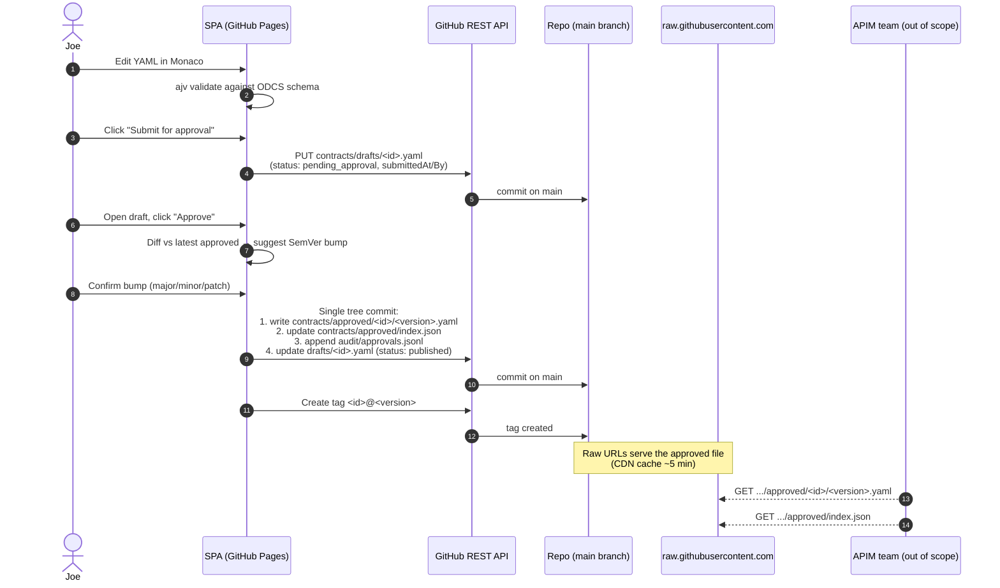

# Architecture — DFT-AV Contract Management PoC

> **Assumption being made.** The brief said *"GitHub App hosts the UI"*. GitHub Apps cannot host UIs — they are server-side OAuth/permission integrations. The simplest GitHub-native equivalent is **GitHub Pages**, served from this repo by an Actions workflow. That is what this plan assumes. If a real GitHub App is wanted later, it would only act as the auth layer in front of the same Pages-hosted SPA.

> **Scope reset.** All previously proposed Azure infra (Static Web Apps, Functions, Cosmos, Key Vault, Entra, Bicep, APIM build) is **out of scope**. APIM remains out of scope and is owned by another team. This PoC ends at *"approved contract is an immutable file at a raw GitHub URL"* — that URL is the handoff point.

---

## 1. Component diagram

```mermaid
flowchart LR
  user["Joe (browser)"]
  spa["SPA on GitHub Pages<br/>Vite + React + TS<br/>Monaco + ajv + octokit"]
  gh["GitHub REST API<br/>(api.github.com)"]
  repo[("Repo: joebent23/dft-av-contract-management<br/>contracts/drafts/<br/>contracts/approved/<br/>audit/approvals.jsonl")]
  raw["raw.githubusercontent.com"]

  subgraph apim_boundary ["APIM team (out of scope)"]
    direction LR
    apim["APIM ingestion<br/>(polling or webhook)"]
    consumers["Downstream consumers"]
  end

  user -->|"loads SPA"| spa
  user -->|"pastes PAT once"| spa
  spa -->|"octokit calls<br/>(read/write Contents)"| gh
  gh --- repo
  repo -. "push to main triggers Pages build" .-> spa
  repo -->|"approved YAML + index.json"| raw
  raw -. "polled / webhooked" .-> apim
  apim --> consumers

  classDef boundary stroke-dasharray: 5 5,fill:#f8f8f8;
  class apim_boundary,apim,consumers boundary;
```



---

## 2. Approval sequence



---

## 3. ODCS contract object model

We use the [Open Data Contract Standard (ODCS)](https://bitol-io.github.io/open-data-contract-standard/) by Bitol, expressed as YAML. ODCS is a YAML/JSON spec describing a data contract's identity, schema, servers, quality rules, team, and SLAs.

Top-level ODCS fields we rely on for the PoC:

| Field             | Purpose                                                                 |
|-------------------|-------------------------------------------------------------------------|
| `apiVersion`      | ODCS spec version (e.g. `v3.0.2`).                                      |
| `kind`            | Always `DataContract`.                                                  |
| `id`              | Stable contract identifier (used as folder name).                       |
| `name`            | Human-readable name.                                                    |
| `version`         | SemVer of this contract revision.                                       |
| `status`          | ODCS lifecycle (`draft`, `active`, `deprecated`). We extend via `pocMeta.status`. |
| `description.purpose` | Short business purpose.                                             |
| `schema`          | Logical schema (objects → properties with types/required/description).  |
| `servers`         | Where the data lives (PoC: descriptive only).                           |
| `quality`         | Quality rules / SLAs.                                                   |
| `team`            | Owners, stewards, contacts.                                             |

**PoC extension — `pocMeta`** (a permitted custom block — ODCS allows custom top-level keys):

```yaml
pocMeta:
  submittingAgency: VCA            # VCA | CCAV | DVSA | DVLA | NUiCO | ASDE | ...
  submissionType: av-incident-report
  status: draft                    # draft | pending_approval | published
  submittedAt: 2026-05-29T10:00:00Z
  submittedBy: joebent23
  approvedAt: null
  approvedBy: null
```

### Worked example — `av-incident-report` v1.0.0

```yaml
apiVersion: v3.0.2
kind: DataContract
id: av-incident-report
name: AV Incident Report
version: 1.0.0
status: active
description:
  purpose: |
    Standardised report submitted by AV operators to DfT when an autonomous
    vehicle is involved in a road incident, per the AV Act 2024 reporting duties.
  usage: Consumed by DfT analytics and the safety regulator pipeline.
  limitations: PoC schema — field names indicative only.
team:
  - username: joebent23
    role: owner
servers:
  - server: raw-github
    type: custom
    description: Approved contract file served from raw.githubusercontent.com
schema:
  - name: IncidentReport
    physicalName: incident_report
    properties:
      - name: incidentId
        logicalType: string
        required: true
        description: Globally unique incident identifier (UUID v4).
      - name: occurredAt
        logicalType: date
        required: true
        description: ISO-8601 UTC timestamp of incident.
      - name: operatorId
        logicalType: string
        required: true
      - name: vehicleVin
        logicalType: string
        required: true
      - name: location
        logicalType: object
        required: true
        properties:
          - name: lat
            logicalType: number
            required: true
          - name: lon
            logicalType: number
            required: true
      - name: severity
        logicalType: string
        required: true
        description: One of minor | major | fatal.
      - name: narrative
        logicalType: string
        required: false
quality:
  - rule: occurredAt must be within last 72 hours of submission
    severity: error
pocMeta:
  submittingAgency: VCA
  submissionType: av-incident-report
  status: published
  submittedAt: 2026-05-29T10:00:00Z
  submittedBy: joebent23
  approvedAt: 2026-05-29T10:05:00Z
  approvedBy: joebent23
```

---

## 4. Storage layout (repo as the database)

| Path                                              | Purpose                                                              |
|---------------------------------------------------|----------------------------------------------------------------------|
| `contracts/drafts/<id>.yaml`                      | Work-in-progress draft. Mutable. `pocMeta.status` ∈ {draft, pending_approval, published}. |
| `contracts/approved/<id>/<version>.yaml`          | Immutable approved version. Never rewritten.                         |
| `contracts/approved/index.json`                   | Generated. Maps `id → { latest, versions[], updatedAt }`.            |
| `audit/approvals.jsonl`                           | Append-only. One JSON object per submit/approve event.               |
| Git tag `<id>@<version>`                          | Marks the commit that introduced the approved version.               |
| GitHub Release (stretch)                          | Attaches the YAML as a release asset for nicer browsing.             |

`index.json` shape:

```json
{
  "av-incident-report": {
    "latest": "1.0.0",
    "versions": ["1.0.0"],
    "updatedAt": "2026-05-29T10:05:00Z",
    "rawUrl": "https://raw.githubusercontent.com/joebent23/dft-av-contract-management/main/contracts/approved/av-incident-report/1.0.0.yaml"
  }
}
```

`audit/approvals.jsonl` entry shape:

```json
{"ts":"2026-05-29T10:05:00Z","event":"approved","id":"av-incident-report","version":"1.0.0","actor":"joebent23","bump":"initial","prevVersion":null,"commit":"<sha>"}
```

---

## 5. Decisions

| # | Decision                                                    | Rationale                                                                                                                                            | Alternatives                                                  | PoC trade-off                                                                                          |
|---|-------------------------------------------------------------|------------------------------------------------------------------------------------------------------------------------------------------------------|---------------------------------------------------------------|--------------------------------------------------------------------------------------------------------|
| 1 | **ODCS YAML** as the contract format                        | Industry standard for data contracts; readable; tooling exists; aligns with Bitol direction; YAML is friendlier in PRs than JSON Schema.            | JSON Schema, AsyncAPI, OpenAPI fragment, custom YAML          | Validator/tooling for ODCS is younger than JSON Schema — we ship `ajv` against the ODCS JSON Schema.   |
| 2 | **GitHub Pages SPA** (Vite + React + TS)                    | Zero infra; native to the repo; one workflow to deploy; demo URL is shareable.                                                                       | Next.js on Vercel, Azure SWA, plain HTML                       | No server-side anything — all GitHub calls happen in the browser with the user's PAT.                  |
| 3 | **Fine-grained PAT in `localStorage`** for auth             | Truly zero-backend; user pastes once; scope can be limited to this repo + `Contents: read/write`; honest about being a PoC shortcut.                | OAuth App (needs token-exchange backend), GitHub App (server) | Token sits in browser storage. Acceptable for a single-user PoC; production must move to OAuth App.    |
| 4 | **Repo-as-store** (folders + tags + append-only `.jsonl`)   | Files are the artefact; git gives history, diff, blame, immutability via tags; raw URLs *are* the public API; no DB to operate.                     | Cosmos, Postgres, GitHub Gists, GitHub Discussions             | No transactional store — concurrency relies on single-actor assumption + git's last-write-wins.        |
| 5 | **Single tree-API commit** for the approve transition       | Atomic across 4 files (new approved YAML, `index.json`, audit line, draft status update). Avoids 4 separate commits that could leave half-state.    | 4 sequential `PUT contents` calls, branch + PR + merge        | If the tree API call fails mid-flight, retry is needed; we surface this in the UI.                     |
| 6 | **SemVer bump heuristic** based on ODCS diff                | Removes guesswork at approve time. Heuristic: removed/required-tightened field ⇒ **major**; new optional field or schema additions ⇒ **minor**; description/quality-text-only changes ⇒ **patch**. User can override. | Always-manual, conventional-commits in PR title              | Heuristic is approximate; we always let Joe override before commit.                                    |

---

## 6. Boundary with the APIM team

**The PoC stops here.** Once approval succeeds, the artefact is publicly addressable at:

- Specific version (immutable):
  `https://raw.githubusercontent.com/joebent23/dft-av-contract-management/main/contracts/approved/<id>/<version>.yaml`
- Latest-pointer index (mutable):
  `https://raw.githubusercontent.com/joebent23/dft-av-contract-management/main/contracts/approved/index.json`

Recommended consumption patterns for the APIM team:

1. **Poll `index.json`** every N minutes; for any contract whose `latest` changed, fetch the new versioned YAML. Simplest, no setup on our side.
2. **Webhook** — we can add a repository webhook (push event on `main`, filter paths `contracts/approved/**`) that calls an APIM-team endpoint. Lower latency, requires their endpoint.
3. **Release-driven** (stretch) — subscribe to GitHub Releases; each approved version creates a release named `<id>@<version>` with the YAML attached.

Caveats to flag with the APIM team:

- raw.githubusercontent.com is CDN-cached (~5 min). Treat the immutable per-version URL as canonical; treat `index.json` as eventually consistent.
- Tags `<id>@<version>` are the authoritative commit reference if they need provenance.
- No auth required to read — repo is intended public for the PoC. If it must be private, they'll need a token of their own.
