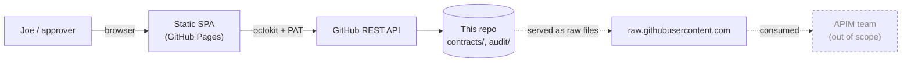
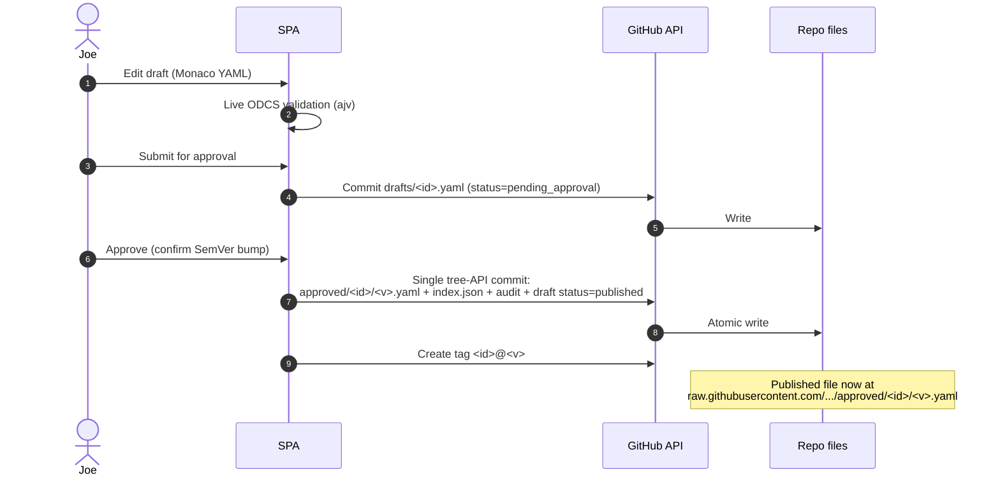

# Architecture (public-facing)

> This is a distilled, public-facing version of the internal architecture notes at
> [`.copilot-tracking/plans/architecture.md`](../.copilot-tracking/plans/architecture.md).
> See that file for the full decision log and PoC-vs-production trade-offs.

## Assumption

The original brief said *"GitHub App hosts the UI"*. GitHub Apps cannot host UIs.
We're interpreting that as **GitHub Pages** — the simplest GitHub-native equivalent — and
treating the GitHub REST API (called from the browser via `@octokit/rest`) as the
"backend".

## Component view

## Approval sequence

## ODCS + `pocMeta`

We use [ODCS](https://bitol-io.github.io/open-data-contract-standard/) as-authored, plus
a small `pocMeta` block for workflow state. See
[contract-model.md](contract-model.md) for the full schema and a worked example.

## Boundary with APIM

The PoC ends at "published immutable YAML at a raw URL". See
[apim-handoff.md](apim-handoff.md) for the recommended consumption patterns.
